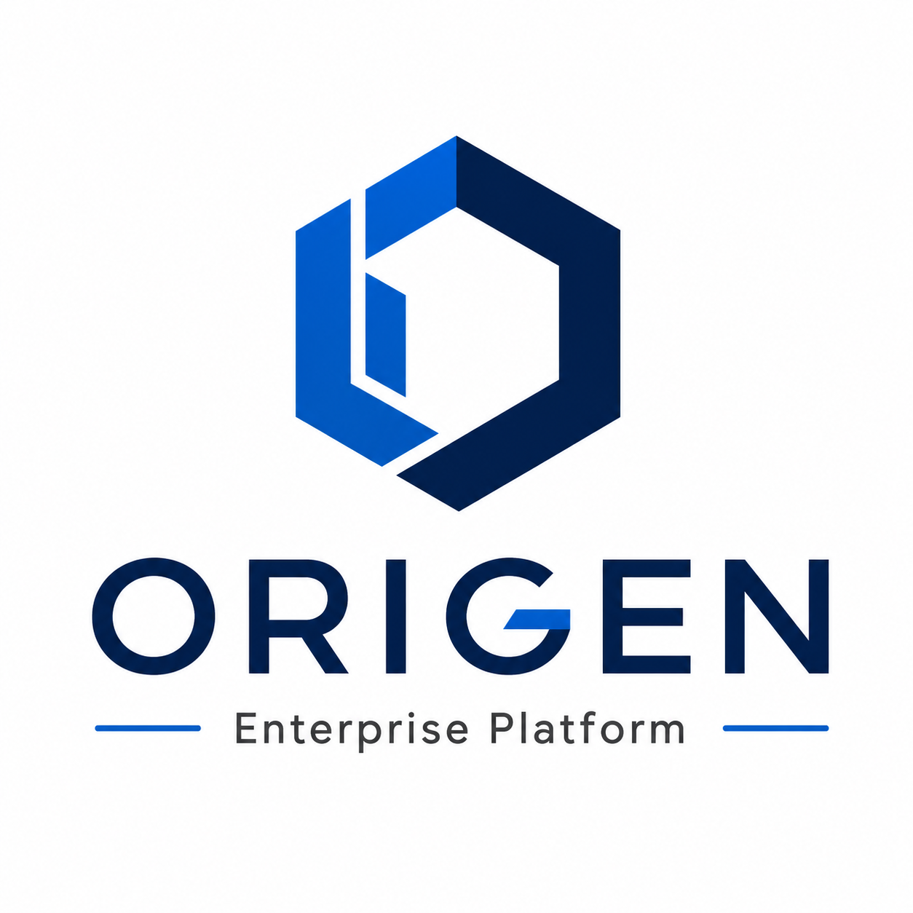
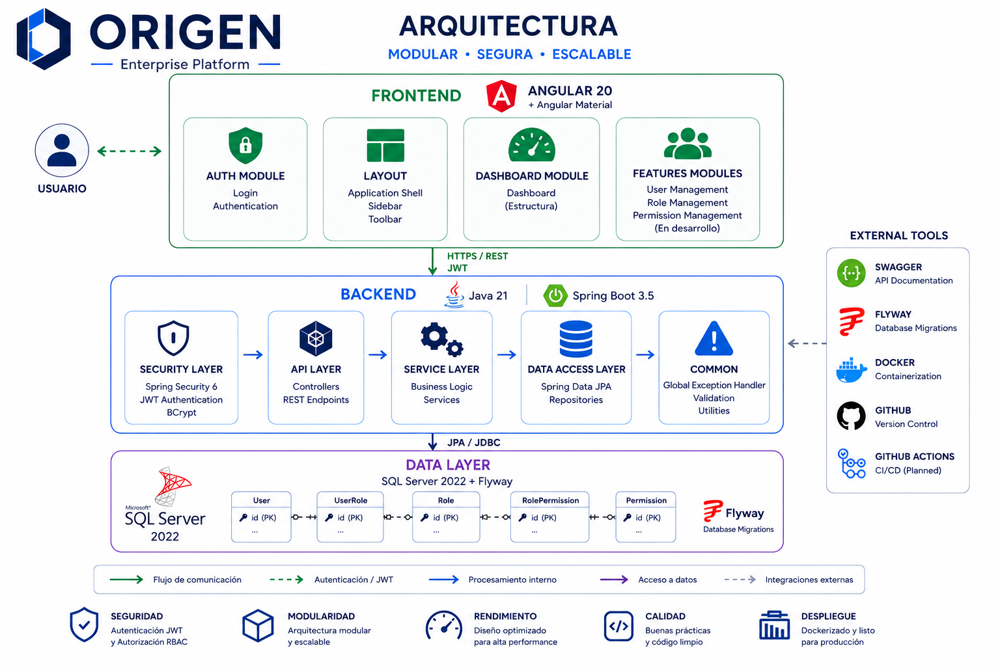

<p align="center">
    
</p>

<h1 align="center">ORIGEN</h1>

<p align="center">
<b>Modern Enterprise Full Stack Platform</b>
</p>

<p align="center">
Java 21 • Spring Boot 3.5 • Angular 20 • SQL Server • JWT • Docker
</p>

---

ORIGEN is a modern enterprise Full Stack platform built to demonstrate production-ready software architecture using **Java 21**, **Spring Boot 3.5**, **Angular 20**, **SQL Server**, and **Spring Security**.

The project emphasizes clean architecture, scalability, maintainability, secure authentication and modular software design following enterprise development practices.

---

# Project Status

| Component | Status |
|-----------|--------|
| Backend | ✅ Stable |
| Authentication | ✅ Completed |
| Authorization (RBAC) | ✅ Completed |
| Angular Bootstrap | ✅ Completed |
| Login Module | ✅ Completed |
| Application Layout | ✅ Completed |
| Dashboard Structure | 🚧 In Progress |
| User Management | 📋 Planned |
| Role Management | 📋 Planned |
| CI/CD | 📋 Planned |

---

# Technology Stack

| Layer | Technologies |
|--------|--------------|
| Backend | Java 21, Spring Boot 3.5 |
| Frontend | Angular 20, Angular Material |
| Security | Spring Security 6, JWT, BCrypt |
| Persistence | Spring Data JPA, Hibernate |
| Database | SQL Server 2022 |
| Database Versioning | Flyway |
| Documentation | OpenAPI / Swagger |
| Infrastructure | Docker, Docker Compose |
| Build | Maven |

---

# Highlights

- Modern Enterprise Full Stack Platform
- Modular Monolith Architecture
- Java 21 + Spring Boot 3.5
- Angular 20 + Angular Material
- Spring Security 6
- JWT Authentication
- Role-Based Access Control (RBAC)
- SQL Server + Flyway
- Dockerized Development Environment
- OpenAPI / Swagger
- Responsive User Interface
- Clean Architecture
- SOLID Principles

---

# System Overview

<p align="center">
    
</p>

ORIGEN follows a modular enterprise architecture where each business module owns its controllers, services, repositories, DTOs and entities, promoting maintainability, scalability and clear separation of responsibilities.

---

# Application Screenshots

## Angular Login

<p align="center">
    
</p>

Modern authentication interface built with Angular 20 and Angular Material.

---

## Swagger API

<p align="center">
    
</p>

Interactive REST API documentation generated using OpenAPI 3.

---

# Current Features

## Backend

- Java 21
- Spring Boot 3.5
- REST API
- Spring Data JPA
- Bean Validation
- Global Exception Handling

## Security

- Spring Security 6
- JWT Authentication
- BCrypt Password Encryption
- Role-Based Access Control (RBAC)

## Database

- SQL Server 2022
- Flyway Database Versioning

## Infrastructure

- Docker
- Docker Compose
- External Configuration

---

# Getting Started

## 1. Clone the repository

```bash
git clone https://github.com/esteban-navarro/ORIGEN.git

cd ORIGEN
```

---

## 2. Configure the Backend

Copy

```text
backend/src/main/resources/application-local.example.yml
```

to

```text
backend/src/main/resources/application-local.yml
```

and configure your local environment.

---

## 3. Start SQL Server

```bash
docker compose -f docker/docker-compose.yml up -d
```

---

## 4. Run the Backend

```bash
cd backend

mvn clean install

mvn spring-boot:run
```

Backend URL

```
http://localhost:8080
```

---

## 5. Run the Frontend

Open a new terminal.

```bash
cd frontend

npm install

ng serve
```

Frontend URL

```
http://localhost:4200
```

Login using the default administrator account:

| Username | Password |
|----------|----------|
| admin | Password123! |

---

## 6. API Documentation

Swagger UI

```
http://localhost:8080/swagger-ui.html
```

OpenAPI

```
http://localhost:8080/v3/api-docs
```

---

# Repository Structure

```text
ORIGEN
│
├── backend
├── frontend
├── database
├── docker
├── docs
│   └── images
├── scripts
├── README.md
└── LICENSE
```

---

# Roadmap

## Completed

- Backend Foundation
- Spring Security
- JWT Authentication
- RBAC Authorization
- SQL Server Integration
- Flyway Migrations
- Docker Environment
- Swagger Documentation
- Angular Bootstrap
- Login Module
- Application Layout

---

## In Progress

- Dashboard Module
- Frontend Navigation
- Feature Modules

---

## Planned

- User Management
- Role Management
- Permission Management
- Refresh Token
- Automated Testing
- GitHub Actions
- CI/CD Pipeline

---

# Development Practices

- Clean Architecture
- SOLID Principles
- Layered Architecture
- REST API Design
- Modular Monolith
- Conventional Commits
- Git Flow
- Clean Code

---

# License

This project is licensed under the MIT License.
