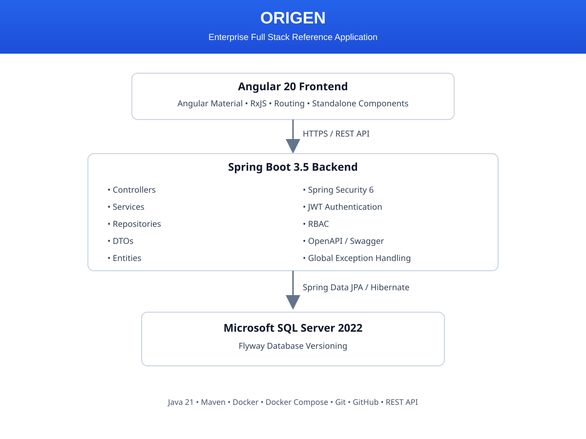
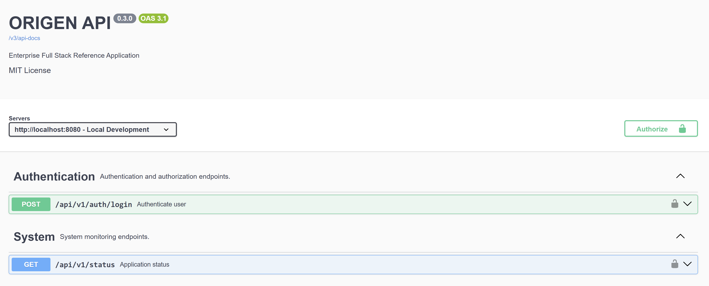
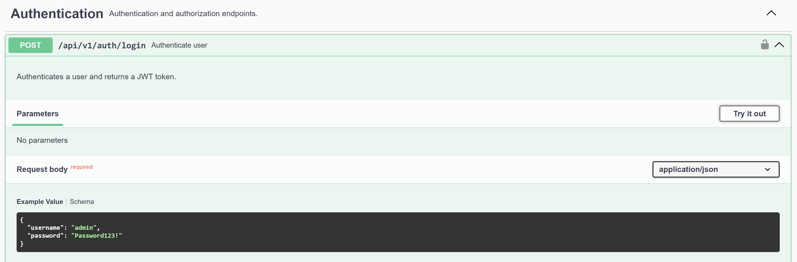

# ORIGEN

### Enterprise Full Stack Reference Application

> Modern Full Stack reference application built with **Java 21**, **Spring Boot 3.5**, **Spring Security**, **SQL Server**, **Angular 20** and modern development practices.

ORIGEN is an enterprise-oriented Full Stack reference application created to demonstrate modern software architecture, secure authentication, scalable application design and clean development practices.

The backend platform is fully implemented, while the Angular frontend is currently under development.

---



---

# Why ORIGEN?

ORIGEN was created as a long-term reference application to demonstrate how a modern enterprise Full Stack system can be designed, implemented and evolved using Java, Spring Boot and Angular.

Instead of focusing on isolated examples, the project emphasizes production-oriented architecture, maintainability, scalability and security.

---

# Highlights

- Enterprise Full Stack Architecture
- Java 21 + Spring Boot 3.5
- Angular 20 *(In Development)*
- Spring Security 6 + JWT Authentication
- Role-Based Access Control (RBAC)
- SQL Server + Flyway
- Dockerized Development Environment
- OpenAPI / Swagger
- RESTful API Design

---

# Technology Stack

| Layer | Technologies | Status |
|--------|--------------|--------|
| Backend | Java 21, Spring Boot 3.5 | ✅ |
| Security | Spring Security 6, JWT, BCrypt | ✅ |
| Persistence | Spring Data JPA, Hibernate | ✅ |
| Database | SQL Server 2022 | ✅ |
| Database Versioning | Flyway | ✅ |
| Documentation | OpenAPI / Swagger | ✅ |
| Infrastructure | Docker, Docker Compose | ✅ |
| Frontend | Angular 20, Angular Material | 🚧 |
| Build | Maven | ✅ |
| CI/CD | GitHub Actions | 📋 Planned |

---

# Project Goals

ORIGEN aims to demonstrate:

- Enterprise software architecture
- Secure authentication and authorization
- Modern Full Stack development
- Clean and maintainable code
- Scalable application design
- Production-oriented development practices

---

# Project Status

| Component | Status |
|-----------|--------|
| Backend | ✅ Stable |
| Authentication | ✅ Completed |
| RBAC | ✅ Completed |
| Database | ✅ Completed |
| Docker | ✅ Completed |
| Swagger | ✅ Completed |
| Angular Frontend | 🚧 In Development |
| Automated Testing | 📋 Planned |
| CI/CD | 📋 Planned |

---

# Architecture

ORIGEN follows a **Modular Monolith** architecture where each business module owns its controllers, services, repositories, DTOs and entities.

## Current Modules

- Authentication Module
- Health Module

## Planned Modules

- User Management Module
- Role Management Module
- Dashboard Module
- Configuration Module

---

# Current Features

## Authentication

- JWT Authentication
- Login API
- Stateless Security
- Spring Security 6
- BCrypt Password Encryption

## Authorization

- Role-Based Access Control (RBAC)
- User ↔ Role relationships
- Role ↔ Permission relationships

## Backend

- Java 21
- Spring Boot 3.5
- Spring Data JPA
- SQL Server
- Flyway Database Versioning
- Global Exception Handling
- OpenAPI Documentation

## Infrastructure

- Docker
- Docker Compose
- External Configuration
- Health Endpoint

---

# Authentication Flow

```text
Client
   │
POST /api/v1/auth/login
   │
AuthenticationController
   │
AuthenticationService
   │
AuthenticationManager
   │
Spring Security
   │
JWT Service
   │
Authenticated Response
```

---

# Database

Current RBAC schema:

```text
User
  │
UserRole
  │
Role
  │
RolePermission
  │
Permission
```

Database migrations are managed using **Flyway**.

Current migrations:

| Version | Description |
|----------|-------------|
| V1 | Initial Schema |
| V2 | Authentication & RBAC |

---

# Screenshots

## Architecture


---

## Swagger UI



---

## Authentication



---

## Angular Frontend

*(Coming Soon)*

---

# Getting Started

## 1. Clone the repository

```bash
git clone https://github.com/esteban-navarro/ORIGEN.git
cd ORIGEN
```

---

## 2. Configure the application

Copy:

```text
backend/src/main/resources/application-local.example.yml
```

to

```text
backend/src/main/resources/application-local.yml
```

Configure your local environment.

---

## 3. Start SQL Server

```bash
docker compose -f docker/docker-compose.yml up -d
```

---

## 4. Build the project

```bash
cd backend
mvn clean install
```

---

## 5. Run the application

```bash
mvn spring-boot:run
```

---

## 6. Open Swagger

Swagger UI

```text
http://localhost:8080/swagger-ui.html
```

OpenAPI

```text
http://localhost:8080/v3/api-docs
```

Health Endpoint

```text
GET /api/v1/status
```

---

# Roadmap

## Completed

- Project Bootstrap
- Spring Boot Configuration
- Docker Environment
- SQL Server Integration
- Flyway Migrations
- Spring Security
- JWT Authentication
- Login API
- RBAC
- Swagger
- Global Exception Handling

---

## Next

- Angular 20 Application
- Dashboard
- User Management
- Role Management
- Permission Management
- JWT Refresh Token
- Automated Testing
- GitHub Actions CI/CD

---

# Repository Structure

```text
ORIGEN
│
├── backend
├── frontend
├── database
├── docker
├── docs
│   └── images
├── scripts
├── README.md
└── LICENSE
```

---

# Development Practices

- Clean Architecture
- Layered Architecture
- SOLID Principles
- REST API Design
- Modular Monolith Architecture
- Conventional Commits
- Git Flow
- Clean Code

---

# License

This project is licensed under the MIT License.
